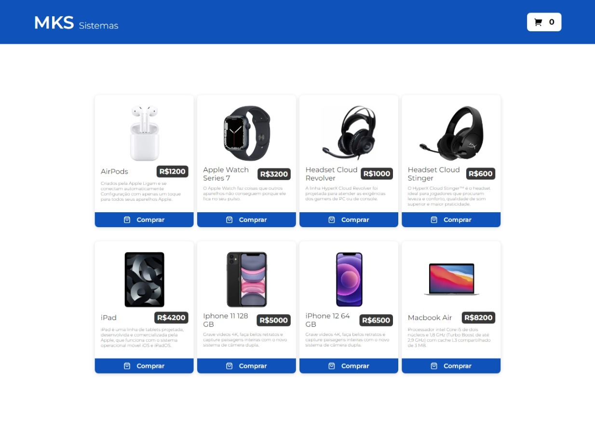

<h1 align="center"> Front-end Challenge </h1>

    Projeto e-Commerce
 

  <a href="#-tecnologias">Tecnologias</a>&nbsp;&nbsp;&nbsp;|&nbsp;&nbsp;&nbsp;
  <a href="#-projeto">Projeto</a>&nbsp;&nbsp;&nbsp;|&nbsp;&nbsp;&nbsp;
  <a href="#-layout">Layout</a>&nbsp;&nbsp;&nbsp;|&nbsp;&nbsp;&nbsp;
  <a href="#memo-licença">Licença</a>

  

 

  

## 🚀 Tecnologias

Esse projeto foi desenvolvido com as seguintes tecnologias:

- Next.js
- Typescript
- Styled-component
- Axios

## 💻 Projeto

No Projeto e-Commerce é listado produtos e tem como funcionalidade adicioná-los no "Carrinho de Compras" visualizando os items adicionado, a quantidade, o valor e por fim o valor final da sua compra.

- [Acesse o projeto finalizado, online](https://front-end-challenge-indol.vercel.app/)

## 🔖 Layout

Você pode visualizar o layout do projeto através [DESSE LINK](https://www.figma.com/file/M2hza6i4eVTeH4gqgRTP3i/MKS-Front-end-challenge?node-id=0%3A1&t=v7COeHbida0XTG4Y-0). É necessário ter conta no [Figma](https://figma.com) para acessá-lo.

## :memo: Licença

Esse projeto está sob a licença MIT.